# agmem - Agentic Memory Version Control System

[](https://pypi.org/project/agmem/)
[](https://www.python.org/downloads/)
[](https://opensource.org/licenses/MIT)
[](https://github.com/psf/black)

> **Git for AI Agent Memories**

agmem is a version control system specifically designed for AI agent memory artifacts. It brings Git's proven concepts—commits, branches, merging, and distributed collaboration—to the world of agent episodic logs, semantic knowledge, and procedural workflows.

## Why agmem?

AI agents accumulate vast amounts of memory: conversation histories, learned facts, user preferences, and problem-solving strategies. But unlike code, agent memory lacks:

- **Version history** - See what an agent learned and when
- **Branching** - Experiment safely with different memory strategies
- **Merging** - Combine knowledge from multiple agents
- **Collaboration** - Share and fork agent memories
- **Rollback** - Undo when agents learn the wrong things

agmem solves all of these problems with a familiar Git-like interface.

## Features

### 🔧 Core Version Control
- ✅ **Git-like workflow** — `init`, `add`, `commit`, `status`, `log`, `branch`, `checkout`, `merge`, `diff`, `show`, `reset`, `tag`, `stash`, `reflog`, `blame`, `tree`, `clean`
- ✅ **HEAD~n resolution** — Walk parent chain: `agmem log HEAD~5`, `agmem show HEAD~1`
- ✅ **Branch/tag names with `/`** — Git-style refs: `feature/test`, `releases/v1` (path-validated)
- ✅ **Content-addressable storage** — SHA-256 deduplication like Git with zlib compression
- ✅ **Memory-type-aware merging** — Episodic append, semantic consolidate, procedural prefer-new

### 🌐 Collaboration & Remotes
- ✅ **Remote operations** — `clone`, `push`, `pull`, `remote` with file:// URLs
- ✅ **Multi-agent trust** — Trust store (full/conditional/untrusted) per public key
- ✅ **Federated collaboration** — Coordinator API for distributed memory sharing
- ✅ **Conflict resolution** — `agmem resolve` with ours/theirs/both strategies

### 🔒 Security & Privacy
- ✅ **Cryptographic verification** — Merkle tree over blobs, Ed25519 signing
- ✅ **Encryption at rest** — AES-256-GCM with Argon2id key derivation
- ✅ **Tamper-evident audit** — Append-only hash-chained log
- ✅ **Differential privacy** — Epsilon/delta budget with fact-level noise
- ✅ **Zero-knowledge proofs** — Keyword containment, memory freshness
- ✅ **PII scanning** — Pre-commit hooks for sensitive data

### 🧠 Intelligence & Search
- ✅ **Semantic search** — Vector embeddings with GPU acceleration
- ✅ **Knowledge graph** — Wikilinks, tags, co-occurrence relationships
- ✅ **Multi-provider LLM** — OpenAI and Anthropic integration
- ✅ **Temporal queries** — Point-in-time and range-based retrieval

### ⚙️ Operations & Performance
- ✅ **Pack files & GC** — Object packing with 5-10x delta compression
- ✅ **Health monitoring** — Storage, redundancy, staleness, graph consistency
- ✅ **IPFS/S3/GCS remotes** — Distributed storage backends
- ✅ **GPU acceleration** — CUDA/MPS detection for embeddings

---

## 🚀 New in v0.3.0: Complete Feature Set

### Phase 1: UX Parity

```mermaid
graph LR
    subgraph Daemon ["🔄 Observation Daemon"]
        D1["Extract MCP<br/>observations"] --> D2["Classify by<br/>memory type"]
        D2 --> D3["Auto-stage<br/>changes"]
        D3 --> D4["Generate commit<br/>message (LLM)"]
    end
    
    subgraph WebUI ["🌐 Web Viewer"]
        W1["Dashboard"] --> W2["Timeline"]
        W2 --> W3["Graph"]
        W3 --> W4["Agents"]
    end
    
    subgraph Search ["🔍 Progressive Search"]
        S1["Layer 1:<br/>Fast index"] --> S2["Layer 2:<br/>Timeline context"]
        S2 --> S3["Layer 3:<br/>Full details"]
    end
    
    subgraph Sessions ["📋 Session Manager"]
        SS1["Start session"] --> SS2["Track observations"]
        SS2 --> SS3["Classify topics"]
        SS3 --> SS4["Auto-commit"]
    end
    
    style Daemon fill:#e3f2fd,stroke:#1976d2,stroke-width:2px
    style WebUI fill:#f3e5f5,stroke:#7b1fa2,stroke-width:2px
    style Search fill:#e8f5e9,stroke:#388e3c,stroke-width:2px
    style Sessions fill:#fff3e0,stroke:#f57c00,stroke-width:2px
```

| Feature | Module | Description |
|---------|--------|-------------|
| **Observation Daemon** | `daemon.py` | Real-time MCP tool observation extraction with LLM commit messages |
| **Web Viewer UI** | `web_ui/` | React dashboard with 22 REST endpoints + WebSocket |
| **Progressive Search** | `search_index.py` | 3-tier search: index → timeline → full details |
| **Session Manager** | `session.py` | Session lifecycle with topic classification |

### Phase 2: Differentiation

```mermaid
graph TB
    subgraph Collab ["👥 Multi-Agent Collaboration"]
        C1["Agent Registry<br/>register, list, trust"]
        C2["Trust Manager<br/>grant, revoke, verify"]
        C3["Contribution Tracker<br/>commits, leaderboard"]
        C4["Conflict Detector<br/>concurrent edits"]
    end
    
    subgraph Compliance ["📋 Compliance Dashboard"]
        CP1["Privacy Manager<br/>budget tracking"]
        CP2["Encryption Verifier<br/>status checks"]
        CP3["Tamper Detector<br/>Merkle verification"]
        CP4["Audit Analyzer<br/>pattern detection"]
    end
    
    subgraph Archaeology ["🏛️ Memory Archaeology"]
        A1["History Explorer<br/>file evolution"]
        A2["Forgotten Finder<br/>unused memories"]
        A3["Pattern Analyzer<br/>recurring themes"]
        A4["Context Reconstructor<br/>historical state"]
    end
    
    subgraph Confidence ["📊 Confidence Scoring"]
        CS1["Decay Model<br/>exponential, linear, step"]
        CS2["Source Tracker<br/>reliability scores"]
        CS3["Confidence Calculator<br/>multi-factor scoring"]
        CS4["Expiration Alert<br/>low-confidence items"]
    end
    
    style Collab fill:#e1f5fe,stroke:#01579b,stroke-width:2px
    style Compliance fill:#fce4ec,stroke:#c2185b,stroke-width:2px
    style Archaeology fill:#f3e5f5,stroke:#7b1fa2,stroke-width:2px
    style Confidence fill:#e8f5e9,stroke:#388e3c,stroke-width:2px
```

| Feature | Module | MCP Tools |
|---------|--------|-----------|
| **Collaboration** | `collaboration.py` | `agent_register`, `trust_grant`, `contributions_list` |
| **Compliance** | `compliance.py` | `privacy_status`, `integrity_verify` |
| **Archaeology** | `archaeology.py` | `forgotten_memories`, `find_context` |
| **Confidence** | `confidence.py` | `confidence_score`, `low_confidence`, `expiring_soon` |

### Phase 3: Advanced Features

```mermaid
graph TB
    subgraph TimeTravel ["⏰ Time-Travel Debugging"]
        T1["TimeExpressionParser<br/>'yesterday', '2 weeks ago'"]
        T2["TemporalNavigator<br/>commit lookup by time"]
        T3["TimelineVisualizer<br/>activity heatmaps"]
        T4["SnapshotExporter<br/>JSON, Markdown, Archive"]
    end
    
    subgraph PrivateSearch ["🔐 Privacy-Preserving Search"]
        P1["SearchTokenizer<br/>blind search tokens"]
        P2["AccessControl<br/>file-level permissions"]
        P3["DP Noise<br/>result randomization"]
        P4["Private Engine<br/>secure retrieval"]
    end
    
    subgraph SemanticGraph ["🕸️ Semantic Memory Graph"]
        G1["GraphBuilder<br/>auto-infer relationships"]
        G2["Clusterer<br/>type, tag, community"]
        G3["GraphSearch<br/>traversal queries"]
        G4["Visualizer<br/>D3 force-directed"]
    end
    
    subgraph Agents ["🤖 Memory Agents"]
        AG1["ConsolidationAgent<br/>merge fragmented"]
        AG2["CleanupAgent<br/>duplicates, stale"]
        AG3["AlertAgent<br/>notifications"]
        AG4["AgentManager<br/>orchestration"]
    end
    
    style TimeTravel fill:#fff3e0,stroke:#e65100,stroke-width:2px
    style PrivateSearch fill:#e8eaf6,stroke:#3f51b5,stroke-width:2px
    style SemanticGraph fill:#e0f2f1,stroke:#00695c,stroke-width:2px
    style Agents fill:#fbe9e7,stroke:#bf360c,stroke-width:2px
```

| Feature | Module | MCP Tools |
|---------|--------|-----------|
| **Time-Travel** | `timetravel.py` | `time_travel`, `timeline` |
| **Private Search** | `private_search.py` | Secure search with access control |
| **Semantic Graph** | `semantic_graph.py` | `memory_graph`, `graph_related` |
| **Memory Agents** | `agents.py` | `agent_health`, `find_duplicates`, `cleanup_candidates` |

---

## 📊 Complete Architecture


---

## 🔄 User Flows

### Memory Commit Flow


### Multi-Agent Collaboration Flow

```mermaid
sequenceDiagram
    participant A1 as 🤖 Agent A
    participant Reg as 📋 Registry
    participant Trust as 🔐 Trust
    participant Remote as 🌐 Remote
    participant A2 as 🤖 Agent B
    
    A1->>Reg: agent_register
    A2->>Reg: agent_register
    
    A1->>Trust: trust_grant(Agent B)
    Trust->>Trust: Verify public key
    
    A1->>Remote: agmem push
    Remote->>Remote: Store commits
    
    A2->>Remote: agmem pull
    Remote->>Trust: Verify origin
    Trust->>A2: Merge if trusted
    
    A2->>A2: contribution_log
```

### Time-Travel Debugging Flow

```mermaid
sequenceDiagram
    participant User as 👤 User
    participant Parser as 📅 Parser
    participant Nav as 🧭 Navigator
    participant VCS as 💾 VCS
    participant Export as 📦 Exporter
    
    User->>Parser: "2 weeks ago"
    Parser->>Parser: Parse expression
    Parser->>Nav: Get commit at time
    Nav->>VCS: Lookup by timestamp
    VCS->>Nav: Return commit hash
    
    alt View timeline
        Nav->>User: Activity heatmap
    else Export snapshot
        Nav->>Export: Export state
        Export->>User: JSON/Markdown/Archive
    end
```

---

### Feature Coverage Overview

```mermaid
graph TB
    subgraph Core ["🔧 Core Features"]
        Core1["✅ Git-like commands<br/>init, add, commit, log, branch, merge"]
        Core2["✅ Content-addressable storage<br/>SHA-256, zlib, dedup"]
        Core3["✅ Memory-type merge<br/>Episodic, Semantic, Procedural"]
    end
    
    subgraph Collab ["👥 Collaboration"]
        Collab1["✅ Remote push/pull<br/>file:// URLs, conflict detection"]
        Collab2["✅ Multi-agent trust<br/>Trust store, key verification"]
        Collab3["✅ Federated sync<br/>Coordinator API"]
    end
    
    subgraph Safety ["🔒 Safety & Integrity"]
        Safety1["✅ Cryptographic<br/>Merkle, Ed25519"]
        Safety2["✅ Tamper detection<br/>Audit trail, hash-chain"]
        Safety3["✅ Encryption at rest<br/>AES-256-GCM"]
    end
    
    subgraph Privacy ["🕵️ Privacy"]
        Privacy1["✅ Differential privacy<br/>Epsilon/delta budget"]
        Privacy2["✅ Zero-knowledge proofs<br/>Keyword, Freshness"]
        Privacy3["✅ PII scanning<br/>Pre-commit hooks"]
    end
    
    subgraph Intelligence ["🧠 Intelligence"]
        Intel1["✅ Semantic search<br/>Vector + Text fallback"]
        Intel2["✅ Knowledge graph<br/>Wikilinks, Co-occurrence"]
        Intel3["✅ LLM integration<br/>OpenAI, Anthropic"]
        Intel4["✅ Temporal queries<br/>Point-in-time, Range"]
    end
    
    subgraph NewFeatures ["🆕 v0.3.0 Features"]
        New1["✅ Web UI + React Frontend<br/>Dashboard, Graph, Timeline"]
        New2["✅ Session Management<br/>Topic classification, auto-commit"]
        New3["✅ Memory Agents<br/>Consolidation, Cleanup, Alerts"]
        New4["✅ Time-Travel<br/>Natural language dates"]
    end
    
    subgraph Ops ["⚙️ Operations"]
        Ops1["✅ Pack/GC<br/>Object packing, cleanup"]
        Ops2["✅ Daemon mode<br/>Watch + auto-commit"]
        Ops3["✅ IPFS/S3/GCS<br/>Distributed storage"]
    end
    
    Core --> Collab
    Collab --> Safety
    Safety --> Privacy
    Privacy --> Intelligence
    Intelligence --> NewFeatures
    NewFeatures --> Ops
    
    style Core fill:#e3f2fd,stroke:#1976d2,stroke-width:2px
    style Collab fill:#f3e5f5,stroke:#7b1fa2,stroke-width:2px
    style Safety fill:#ffebee,stroke:#c62828,stroke-width:2px
    style Privacy fill:#e1f5fe,stroke:#01579b,stroke-width:2px
    style Intelligence fill:#f1f8e9,stroke:#558b2f,stroke-width:2px
    style NewFeatures fill:#fff8e1,stroke:#f9a825,stroke-width:3px
    style Ops fill:#fff3e0,stroke:#e65100,stroke-width:2px
```

## Quick Start

### Installation

**From PyPI** ([pypi.org/project/agmem](https://pypi.org/project/agmem/)):

```bash
pip install agmem
```

Or install from source:

```bash
git clone https://github.com/vivek-tiwari-vt/agmem.git
cd agmem
pip install -e .
```

### Initialize a Repository

```bash
agmem init
```

This creates a `.mem/` directory and a `current/` working directory with subdirectories for different memory types:

```
.mem/                      # Repository internals
├── objects/               # Content-addressable storage
├── refs/                  # Branch and tag references
├── staging/               # Staging area
├── index.json             # Staging index
└── config.json            # Repository configuration

current/                   # Working directory
├── episodic/              # Session logs, conversation history
├── semantic/              # Facts, user preferences, knowledge
├── procedural/            # Workflows, prompt templates
├── checkpoints/           # Agent state snapshots
└── session-summaries/     # AI-generated summaries
```

### Basic Workflow

```bash
# Add memory files
agmem add episodic/session-2026-01-31.md
agmem add semantic/user-preferences.md

# Or add all changes
agmem add .

# Check status
agmem status

# Commit changes
agmem commit -m "Learned user prefers dark mode and Python"

# View history
agmem log

# Create a branch for experimentation
agmem branch experiment
agmem checkout experiment

# Make changes and commit
agmem add .
agmem commit -m "Experimenting with new workflow"

# Switch back and merge
agmem checkout main
agmem merge experiment

# See who changed each line of a memory file (like git blame)
agmem blame current/semantic/user-preferences.md

# Stash work in progress, then restore
agmem stash push -m "WIP"
agmem stash list
agmem stash pop

# View HEAD history (reflog)
agmem reflog
```

## Commands

All commands are listed below. Highlights: **`agmem blame <file>`** (who changed each line), **`agmem daemon`** (watch + optional auto-commit), **`agmem garden`** (episode archival & consolidation), **`agmem fsck`** (integrity check). See [Inspection & maintenance](#inspection--maintenance) for blame, daemon, and garden details.

### Core (Git-like)

| Command | Description |
|---------|-------------|
| `agmem init` | Initialize a new repository |
| `agmem add <file>` | Stage files (paths under `current/` validated) |
| `agmem commit -m "msg"` | Save staged changes |
| `agmem status` | Show working tree status |
| `agmem log [ref]` | Commit history; supports `HEAD~n`, `--oneline`, `-n` |
| `agmem branch` | List branches |
| `agmem branch <name>` | Create branch (names like `feature/test` allowed) |
| `agmem checkout <ref>` | Switch branch or detached commit |
| `agmem merge <branch>` | Merge into current branch |
| `agmem diff [ref1 [ref2]]` | Show changes |
| `agmem show <object>` | Show commit/blob/tree (supports `HEAD~n`) |
| `agmem tag <name>` | Create tag at HEAD |
| `agmem reset <ref>` | Reset HEAD or file |
| `agmem tree [ref]` | Directory tree of `current/` |
| `agmem stash` | push / pop / list |
| `agmem clean -f` | Remove untracked files |
| `agmem blame <file>` | **Who changed each line** — commit hash, author, line number, content (like `git blame`) |
| `agmem reflog` | HEAD change history (branch/checkout/commit) |

### Remote & integrity

| Command | Description |
|---------|-------------|
| `agmem clone <url> [dir]` | Clone repo (file:// URLs); path-validated; copies remote public keys |
| `agmem remote add <name> <url>` | Add remote |
| `agmem remote show` | List remotes |
| `agmem push <remote> <branch>` | Push branch (refs validated); rejects non–fast-forward |
| `agmem pull [--remote <name>] [--branch <b>]` | Fetch and merge into current branch; optional crypto/trust checks |
| `agmem fsck` | Check objects, refs, optional vector store, Merkle roots and signatures |
| `agmem verify [ref]` | Belief consistency (contradictions); use `--crypto` to verify commit Merkle/signature |
| `agmem audit [--verify] [--max n]` | Show tamper-evident audit log; `--verify` checks hash chain |
| `agmem resolve [path]` | Resolve merge conflicts (ours/theirs/both); path under `current/` |
| `agmem gc [--dry-run] [--repack] [--prune-days n]` | Garbage collection: delete unreachable loose objects; optional pack file creation |
| `agmem prove --memory <path> --property keyword\|freshness --value <v> [-o out]` | Generate ZK proofs (keyword: Merkle set membership; freshness: signed timestamp) |
| `agmem federated push\|pull` | Federated collaboration (real summaries, optional DP; requires coordinator in config) |

### Optional (install extras)

| Command | Extra | Description |
|---------|-------|-------------|
| `agmem search <query>` | `agmem[vector]` | Semantic search; else plain text over `current/` |
| `agmem graph` | — | Knowledge graph from wikilinks/tags; `--no-similarity` skips vector |
| `agmem graph --serve` | `agmem[web]` | Serve graph UI (same as `agmem serve`) |
| `agmem serve` | `agmem[web]` | Web UI for history and diffs |
| `agmem daemon` | `agmem[daemon]` | **Watch `current/`** — optional auto-commit after debounce; `daemon run` / `status` / `start` / `stop` |
| `agmem garden` | — | **Episode archival & consolidation** — archive old episodic files, merge semantic facts; `--dry-run` supported |
| `agmem mcp` | `agmem[mcp]` | MCP server for Cursor/Claude |

### Refs and optional extras

- **Branch and tag names** can include `/` (e.g. `feature/test`, `releases/v1`); the resolved path must stay under `refs/heads` or `refs/tags` (Git-style).
- **HEAD~n** is supported for walking the commit parent chain (e.g. `agmem log HEAD~5`, `agmem show HEAD~1`).
- **Search:** Semantic search when `pip install agmem[vector]`; otherwise `agmem search` falls back to plain text (grep-style) search over `current/`.
- **Web:** `agmem serve` and `agmem graph --serve` require `pip install agmem[web]`.
- **Daemon:** `agmem daemon` requires `pip install agmem[daemon]`.
- **MCP:** `agmem mcp` requires `pip install agmem[mcp]`.

---

## Inspection & maintenance

### Blame — who changed each line

See which commit and author last modified each line of a memory file (like `git blame`):

```bash
agmem blame current/semantic/user-preferences.md
agmem blame episodic/session1.md
```

Output: commit hash (short), author, line number, and line content. Use this to trace where a fact or session line came from, or for audits.

### Daemon — watch and auto-commit (optional)

Run a background process that watches `current/` and can auto-commit when files change. Requires the `daemon` extra (watchdog).

```bash
pip install agmem[daemon]
agmem daemon run          # Watch current/, optional auto-commit after debounce
agmem daemon status       # Show if daemon is running
agmem daemon start        # Start in background (uses .mem/daemon.pid by default)
agmem daemon stop         # Stop the daemon
```

Use when you want memory changes to be committed automatically after a short idle period, or to keep a live view of the repo.

### Garden — episode archival & consolidation (optional)

Archive old episodic files and consolidate semantic memory. All paths stay under `current/` (path-validated).

```bash
agmem garden              # Run archival and consolidation (see config)
agmem garden --dry-run    # Show what would be archived/consolidated without writing
```

Configure in `.mem/config.json` (e.g. `archive_dir`, consolidation thresholds). Use to keep `current/episodic/` manageable and to merge related semantic facts.

### Integrity check

```bash
agmem fsck
```

Verifies objects, refs, and (if installed) the vector store. When commit metadata includes `merkle_root` and optionally `signature`, fsck also runs cryptographic verification. Run after cloning or if something looks wrong.

---

## Security Architecture

agmem implements security in layers. Choose what you need:

```mermaid
graph TB
    subgraph L1 ["🔒 Tier 1: Cryptographic Integrity"]
        T1A["✅ Merkle tree<br/>over blobs"]
        T1B["✅ Ed25519<br/>signatures"]
        T1C["✅ Tamper<br/>detection"]
    end
    
    subgraph L2 ["🔐 Tier 2: Multi-Agent Trust"]
        T2A["✅ Trust store<br/>per public key"]
        T2B["✅ Multi-agent<br/>collaboration"]
        T2C["✅ Conflict<br/>resolution"]
    end
    
    subgraph L3 ["🕵️ Tier 3: Privacy & Anonymity"]
        T3A["✅ Differential<br/>Privacy budget"]
        T3B["✅ Zero-Knowledge<br/>Proofs"]
        T3C["✅ Encrypted<br/>at rest"]
    end
    
    subgraph L4 ["🌐 Tier 4: Distribution"]
        T4A["✅ S3/GCS<br/>remotes"]
        T4B["✅ IPFS<br/>support"]
        T4C["✅ Pack files<br/>& GC"]
    end
    
    subgraph L5 ["📊 Tier 5: Audit & Compliance"]
        T5A["✅ Append-only<br/>audit log"]
        T5B["✅ Hash-chained<br/>verification"]
        T5C["✅ Full history<br/>& blame"]
    end
    
    L1 --> L2 --> L3 --> L4 --> L5
    
    style L1 fill:#ffebee,stroke:#c62828
    style L2 fill:#ede7f6,stroke:#512da8
    style L3 fill:#e1f5fe,stroke:#01579b
    style L4 fill:#f3e5f5,stroke:#7b1fa2
    style L5 fill:#e8f5e9,stroke:#1b5e20
```

---

## Security, trust & advanced features


The following 18 capabilities are implemented (or stubbed) per the agmem features implementation plan. They are grouped by tier.

### Tier 1 — Security and trust

| # | Feature | Description |
|---|---------|-------------|
| **1** | **Cryptographic commit verification** | Merkle tree over commit blobs; Ed25519 signing of Merkle root; verification on checkout, pull, `agmem verify --crypto`, and `agmem fsck`. Merkle proofs for single-blob verification. Keys: `.mem/keys/`; private key from env `AGMEM_SIGNING_PRIVATE_KEY` or `AGMEM_SIGNING_PRIVATE_KEY_FILE`. Old commits without `merkle_root` are unverified. |
| **2** | **Encryption at rest** | Optional AES-256-GCM for object contents; key from passphrase via Argon2id; hash-then-encrypt preserves deduplication. Config in `.mem/encryption.json` or repo config; opt-in. |
| **3** | **Tamper-evident audit trail** | Append-only, hash-chained log in `.mem/audit/` for init, add, commit, checkout, merge, push, pull, config. **Commands:** `agmem audit` (show entries), `agmem audit --verify` (verify chain). |

### Tier 2 — Multi-agent collaboration

| # | Feature | Description |
|---|---------|-------------|
| **4** | **Multi-agent trust and identity** | Trust store (full / conditional / untrusted) per public key; applied on pull and merge. Clone copies remote public keys; user adds them to trust store. Identity = keypair (same as commit signing). |
| **5** | **Federated memory collaboration** | Agents share summaries or aggregated updates via a coordinator. **Command:** `agmem federated push` / `agmem federated pull` (stub). Config: `federated.enabled`, `coordinator_url`. |
| **6** | **Conflict resolution interface** | Structured resolution: ours / theirs / both per path. **Command:** `agmem resolve [path]`. Conflicts persisted in `.mem/merge/conflicts.json`; path traversal protected. |

### Tier 3 — Privacy

| # | Feature | Description |
|---|---------|-------------|
| **7** | **Differential privacy** | Epsilon/delta budget per repo in `.mem/privacy_budget.json`. **Usage:** `agmem distill --private`, `agmem garden --private`; blocks when budget exceeded. Config: `differential_privacy.max_epsilon`, `delta`. **Note:** Now correctly applied to actual facts during extraction, not metadata counts. |
| **8** | **Cryptographic proofs (proof-of-knowledge)** | Hash/signature-based proofs for keyword containment (Merkle set membership) and memory freshness (signed timestamp). **Command:** `agmem prove --memory <path> --property keyword\|freshness --value <v> [-o out]`. **IMPORTANT:** These are proof-of-knowledge, not true zero-knowledge proofs. Keyword proof leaks word count and allows verifier to test other words. Freshness proof relies on forgeable filesystem mtime. See `memvcs/core/zk_proofs.py` for details and migration path to zk-SNARKs. |

### Tier 4 — Storage and distribution

| # | Feature | Description |
|---|---------|-------------|
| **9** | **Decentralized storage (IPFS)** | Push/pull via gateway (POST /api/v0/add, GET /ipfs/<cid>). Bundle/unbundle in `memvcs.core.ipfs_remote`; optional `agmem[ipfs]`. |
| **10** | **Pack files and garbage collection** | Pack loose objects into pack file + index; GC deletes unreachable; ObjectStore reads from pack. **Command:** `agmem gc [--dry-run] [--repack] [--prune-days n]`. |
| **11** | **Enhanced cloud remote operations** | Push conflict detection; S3/GCS remotes with distributed locking (acquire before push/fetch, release in finally). Config: `lock_table` for S3. |

### Tier 5 — Intelligence and retrieval

| # | Feature | Description |
|---|---------|-------------|
| **12** | **Multi-provider LLM** | `memvcs.core.llm`: OpenAI and Anthropic; factory by config or env. Used by gardener, distiller, consistency checker, merge. Credentials via env (e.g. `OPENAI_API_KEY`, `ANTHROPIC_API_KEY`). |
| **13** | **Enhanced semantic compression** | Multi-stage pipeline in `memvcs.core.compression_pipeline`: chunk, fact extraction, dedup by hash; hybrid retrieval in strategies. |
| **14** | **Temporal querying and time-travel** | Point-in-time and range in `memvcs.core.temporal_index`; CLI: `agmem when --from/--to`, `agmem timeline --from/--to`. |
| **15** | **Cross-memory relationship graph** | Knowledge graph: co-occurrence, causal edges; incremental-update docstring in `knowledge_graph.py`. |

### Tier 6 — Operations and maintenance

| # | Feature | Description |
|---|---------|-------------|
| **16** | **Automated memory health monitoring** | Daemon: configurable `daemon.health_check_interval_seconds` and `AGMEM_DAEMON_HEALTH_INTERVAL`; alert only on verify failure; suggest `agmem fsck`. |
| **17** | **GPU-accelerated operations** | Vector store `_device()` returns cuda/mps/cpu; model loaded with that device. |
| **18** | **Test suite and quality** | Tests: crypto (tampered blob, key missing), encryption (wrong key, corrupted ciphertext), privacy budget, pack/GC, ZK prove/verify, federated mock, IPFS bundle; see docs/TEST_REPORT.md. |

### New files and config (summary)

| Addition | Purpose |
|----------|---------|
| `memvcs/core/crypto_verify.py` | Merkle build/verify, Ed25519 sign/verify, Merkle proofs |
| `memvcs/core/audit.py` | Tamper-evident audit append and verify |
| `memvcs/core/trust.py` | Trust store (key → level) |
| `memvcs/core/privacy_budget.py` | Epsilon/delta budget for DP |
| `memvcs/core/pack.py` | Pack format, index, GC, repack |
| `memvcs/core/compression_pipeline.py` | Chunk, fact extraction, dedup; hybrid retrieval |
| `memvcs/core/zk_proofs.py` | Hash/signature-based proofs (keyword, freshness) |
| `docs/FEDERATED.md` | Coordinator API for federated push/pull |
| `memvcs/core/encryption.py` | AES-256-GCM, Argon2id, config |
| `memvcs/core/llm/` | LLM provider interface and OpenAI/Anthropic |
| `memvcs/core/zk_proofs.py` | ZK proof stubs |
| `memvcs/core/federated.py` | Federated push/pull stubs |
| `.mem/audit/` | Audit log |
| `.mem/keys/` | Public (and optional private) keys |
| `.mem/trust/` or config | Trust store |
| `.mem/privacy_budget.json` | DP budget state |
| `.mem/merge/conflicts.json` | Unresolved merge conflicts |
| Commit `metadata` | `merkle_root`, `signature` |

---

## Memory Types

agmem recognizes three types of agent memory:

### Episodic Memory
Time-stamped records of agent interactions:
```
current/episodic/
├── 2026-01-31-session1.md
├── 2026-01-31-session2.md
└── 2026-02-01-session1.md
```

**Merge strategy:** Append chronologically (no conflicts)

### Semantic Memory
Factual knowledge and learned patterns:
```
current/semantic/
├── user-preferences.md
├── project-context.md
└── domain-knowledge.md
```

**Merge strategy:** Smart consolidation with conflict markers

### Procedural Memory
Workflows and prompt templates:
```
current/procedural/
├── coding-workflow.md
└── debugging-process.md
```

**Merge strategy:** Prefer newer, flag for manual review

## How It Works

### Memory Flow

```mermaid
graph LR
    A["📂 Working Directory<br/>current/<br/>episodic/<br/>semantic/<br/>procedural/"] 
    B["📝 Staging Area<br/>index.json<br/>staged files"]
    C["💾 Object Storage<br/>.mem/objects/<br/>blobs → trees → commits"]
    D["📍 References<br/>.mem/refs/<br/>HEAD, branches, tags"]
    
    A -->|agmem add| B
    B -->|agmem commit| C
    C --> D
    
    style A fill:#e1f5ff,stroke:#01579b,stroke-width:2px
    style B fill:#fff3e0,stroke:#e65100,stroke-width:2px
    style C fill:#f3e5f5,stroke:#4a148c,stroke-width:2px
    style D fill:#e8f5e9,stroke:#1b5e20,stroke-width:2px
```

### Merge Strategies by Memory Type

```mermaid
graph TB
    A["🌿 Branch A"] --> E{Memory Type?}
    B["🌿 Branch B"] --> E
    
    E -->|"<b>Episodic</b><br/>session logs"| F["⏰ Chronological<br/>Append"]
    E -->|"<b>Semantic</b><br/>learned facts"| G["🤝 Conflict<br/>Markers"]
    E -->|"<b>Procedural</b><br/>workflows"| H["✨ Prefer New<br/>with Flag"]
    
    F --> I["✅ No Conflicts<br/>Deterministic merge"]
    G --> J["⚠️ Manual Review<br/>Conflict markers"]
    H --> J
    
    style E fill:#ffebee,stroke:#b71c1c,stroke-width:2px
    style F fill:#c8e6c9,stroke:#1b5e20,stroke-width:2px
    style G fill:#ffe0b2,stroke:#e65100,stroke-width:2px
    style H fill:#b3e5fc,stroke:#01579b,stroke-width:2px
    style I fill:#81c784,stroke:#1b5e20,stroke-width:2px
    style J fill:#ffb74d,stroke:#e65100,stroke-width:2px
```

### How Others Handle Memory vs agmem

```mermaid
graph LR
    subgraph Cursor ["Cursor<br/>Ephemeral"]
        C1["❌ No history"]
        C2["❌ No branching"]
        C3["❌ Session-based"]
    end
    
    subgraph Claude ["Claude Code<br/>File-based"]
        Cl1["⚠️ Manual Git"]
        Cl2["❌ Not memory-aware"]
        Cl3["⚠️ At launch"]
    end
    
    subgraph Mem0 ["Mem0<br/>Cloud/Vector"]
        M1["⚠️ Proprietary"]
        M2["❌ No branching"]
        M3["❌ Black box"]
    end
    
    subgraph agmem_box ["agmem<br/>Git for Memory"]
        A1["✅ Full history"]
        A2["✅ Branches & merge"]
        A3["✅ Local-first"]
        A4["✅ Type-aware"]
        A5["✅ Open source"]
    end
    
    style Cursor fill:#ffebee,stroke:#c62828,stroke-width:2px
    style Claude fill:#fff3e0,stroke:#f57c00,stroke-width:2px
    style Mem0 fill:#ede7f6,stroke:#512da8,stroke-width:2px
    style agmem_box fill:#c8e6c9,stroke:#1b5e20,stroke-width:3px
```

| Tool | Approach | agmem Advantage |
|------|----------|--------|
| **Cursor** | Ephemeral, session-based context | ✅ Full history, persistent, branching |
| **Claude Code** | File-based (CLAUDE.md); needs Git | ✅ Memory-type-aware merge strategies |
| **Mem0** | Cloud/API with vector persistence | ✅ Local-first, transparent, version control |
| **agmem** | 🎯 **Git for Agent Memory** | Version history, branching, merging, local-first, type-aware |

## Example: Multi-Agent Collaboration

```bash
# Agent A creates base memory
agmem init --author-name "Agent-A"
echo "User prefers Python" > current/semantic/preferences.md
agmem add .
agmem commit -m "Initial preferences"

# Agent B clones and extends
# cd agent-b-memory
# agmem clone file:///path/to/agent-a
# echo "User also likes TypeScript" >> current/semantic/preferences.md
# agmem add .
# agmem commit -m "Added TypeScript preference"

# Agent A pulls and merges Agent B's changes
# agmem pull
# agmem merge agent-b/main
```

## Storage (Git-Like)

agmem stores agent memory exactly like Git stores code:

| Git | agmem |
|-----|-------|
| `.git/objects/` | `.mem/objects/` |
| Blob, Tree, Commit | Same (content-addressable) |
| SHA-1 | SHA-256 |
| zlib compression | zlib compression |
| Deduplication | Deduplication |
| `refs/heads/` | `refs/heads/` |
| `refs/tags/` | `refs/tags/` |
| Reflog | Reflog |
| Stash | Stash |

**Working directory:** `current/` with episodic, semantic, procedural, checkpoints, session-summaries. Same mental model as Git's working tree.

**Security:** Paths, refs, and object hashes are validated everywhere (no path traversal). Branch/tag names may include `/` but must resolve under `refs/heads` or `refs/tags`. Remote URLs (file://) and clone targets are validated. `serve` binds to 127.0.0.1 by default.

- **Content-addressable objects** — Blobs, trees, commits hashed with SHA-256
- **Compression** — zlib for efficient storage
- **Deduplication** — Same content = same hash, stored once
- **Reflog** — History of HEAD changes (commit, checkout)
- **Stash** — Temporary storage for work-in-progress

## Configuration

### Repository config (`.mem/config.json`)

Repository configuration is stored in `.mem/config.json`:

```json
{
  "author": {
    "name": "Agent",
    "email": "agent@example.com"
  },
  "core": {
    "default_branch": "main",
    "compression": true,
    "gc_prune_days": 90
  },
  "memory": {
    "auto_summarize": true,
    "summarizer_model": "default",
    "max_episode_size": 1048576,
    "consolidation_threshold": 100
  },
  "differential_privacy": {
    "max_epsilon": 1.0,
    "delta": 1e-5
  },
  "federated": {
    "enabled": false,
    "coordinator_url": ""
  }
}
```

Optional sections: **`differential_privacy`** (for `--private` on distill/garden); **`federated`** (for `agmem federated`); **`signing`** (public key for commit verification); trust store under `.mem/trust/` or config; encryption in `.mem/encryption.json` when enabled.

### agmem config (cloud and PII)

Optional user/repo config for S3/GCS and PII hooks:

- **User-level**: `~/.config/agmem/config.yaml` (or `$XDG_CONFIG_HOME/agmem/config.yaml`)
- **Repo-level**: `<repo>/.agmemrc` or `<repo>/.mem/config.yaml` (YAML)

Repo overrides user. **Never put secrets in config files.** Credentials are supplied via environment variables (or standard AWS/GCP mechanisms). Config may reference env var *names* only (e.g. `access_key_var: AWS_ACCESS_KEY_ID`). See [docs/CONFIG.md](docs/CONFIG.md) for schema and examples.

- **Cloud (S3/GCS)**: region, endpoint, env var names for credentials; GCS can use `credentials_path` (validated under repo/home) or `credentials_json_var` (env var containing JSON key).
- **PII**: `pii.enabled` (default true) to enable/disable pre-commit PII scanning; `pii.allowlist` (path globs) to skip scanning certain files.

## Architecture

agmem follows Git's proven architecture:

```mermaid
graph TB
    subgraph Commands ["🎯 Commands - Porcelain (What you type)"]
        A1["init, add, commit, status, log, diff, show, tag, reset, tree"]
        A2["branch, checkout, merge, stash, clean, blame, reflog"]
        A3["clone, push, pull, remote, fsck, verify, audit, resolve"]
        A4["gc, prove, federated, search, graph, serve, daemon, garden"]
    end
    
    subgraph Core ["⚙️ Core Operations - Plumbing (What happens)"]
        B1["Staging Area<br/>index.json"]
        B2["Objects<br/>Blob, Tree, Commit, Tag"]
        B3["References<br/>HEAD, Branches, Tags"]
        B4["Memory-type Merge<br/>Episodic, Semantic, Procedural"]
    end
    
    subgraph Storage ["💾 Storage - Disk (Where data lives)"]
        C1["SHA-256 Hashing"]
        C2["zlib Compression"]
        C3["Deduplication"]
        C4["Validation<br/>Path, Ref, Hash"]
    end
    
    subgraph Features ["🔐 Advanced Features"]
        D1["Crypto Verification<br/>Merkle, Ed25519"]
        D2["Encryption at Rest<br/>AES-256-GCM"]
        D3["Privacy<br/>Differential Privacy"]
        D4["Trust & Audit<br/>Multi-agent, Hash-chain"]
    end
    
    Commands --> Core
    Core --> Storage
    Storage --> Features
    
    style Commands fill:#e3f2fd,stroke:#1976d2,stroke-width:2px
    style Core fill:#f3e5f5,stroke:#7b1fa2,stroke-width:2px
    style Storage fill:#fff3e0,stroke:#f57c00,stroke-width:2px
    style Features fill:#e8f5e9,stroke:#388e3c,stroke-width:2px
```

## Development

```bash
# Clone repository
git clone https://github.com/vivek-tiwari-vt/agmem.git
cd agmem

# Install development dependencies
pip install -e ".[dev]"

# Run tests
pytest

# Format code
black memvcs/

# Type check
mypy memvcs/
```

## Roadmap

- [x] Core object storage (blob, tree, commit)
- [x] Basic commands (init, add, commit, status, log, diff, show, reset, tag, stash, reflog, blame, tree, clean)
- [x] HEAD~n resolution; branch/tag names with `/` (Git-style)
- [x] Branching and checkout; merging with memory-type-aware strategies
- [x] Remote operations (clone, push, pull, remote) — file:// URLs; pull merges into current branch; push conflict detection
- [x] Search — semantic with `agmem[vector]`, plain text fallback
- [x] Knowledge graph (`agmem graph`) — wikilinks, tags, optional similarity; `--no-similarity`, `--serve`
- [x] Integrity (`agmem fsck`); path/ref/hash validation; Merkle/signature verification
- [x] Web UI (`agmem serve`); MCP server (`agmem mcp`); daemon (`agmem daemon`); garden (`agmem garden`)
- [x] Cryptographic commit verification (Merkle tree, Ed25519 signing, verify on checkout/pull/fsck)
- [x] Tamper-evident audit trail (`agmem audit`); multi-agent trust store; conflict resolution (`agmem resolve`)
- [x] Encryption at rest (optional AES-256-GCM); differential privacy budget (`--private` on distill/garden)
- [x] Pack files and garbage collection (`agmem gc`); ZK proofs and federated stubs (`agmem prove`, `agmem federated`)
- [x] Multi-provider LLM (OpenAI, Anthropic); temporal range queries; daemon health checks; GPU detection; test suite and CI
- [x] **Phase 1: UX Parity** — Observation daemon, web viewer UI, progressive disclosure search, session-aware auto-commit
- [x] **Phase 2: Differentiation** — Multi-agent collaboration, compliance dashboard, memory archaeology, confidence scoring
- [x] **Phase 3: Advanced Features** — Time-travel debugging, privacy-preserving search, semantic memory graph, memory agents
- [x] **React Frontend** — Interactive force-directed graph visualization with search, zoom, pan, node dragging
- [x] **WebSocket Support** — Real-time updates for file changes, commits, and agent activity
- [x] **Service Templates** — systemd and launchd service files for daemon deployment
- [ ] IPFS remote (stub in place); full ZK circuits and federated coordinator


## Integrations

```
  Cursor ────────╮
  Claude Code ───┼──►  MCP Server  ──►  current/  ──►  .mem/
  Windsurf ──────┤     (agmem mcp)      episodic/
  Continue ──────╯                      semantic/
                                         procedural/

  Python API ────►  Repository()  ──►  (same)
  LangChain
  LangGraph
```

### Cursor

1. Install: `pip install agmem[mcp]`
2. Add MCP server to Cursor settings (Settings → MCP → Edit Config):

```json
{
  "mcpServers": {
    "agmem": {
      "command": "agmem",
      "args": ["mcp"]
    }
  }
}
```

3. Use memory tools in chat: `memory_read`, `memory_search`, `memory_add`, `memory_log`, `memory_diff`
4. Optional: Add Cursor rules pointing to `current/` for automatic context loading

### Claude Code

Same MCP setup as Cursor. Claude Desktop uses MCP natively. File-based memory (CLAUDE.md, .claude/rules) can coexist with agmem—agmem adds version control on top.

### Other IDEs

Any MCP-compatible client (Windsurf, Continue, etc.) works with the same config. Use the Python API for custom integrations.

### Vector Search

```bash
pip install agmem[vector]
agmem search "user prefers Python"
agmem search "workflow" --rebuild   # Rebuild index after many changes
```

When `agmem[vector]` is not installed, `agmem search` uses plain text (grep-style) search over `current/**/*.md` and `*.txt`.

### Knowledge graph

```bash
agmem graph                    # Summary: nodes, edges by type, isolated files
agmem graph --no-similarity     # Wikilinks + tags only (no vector store)
agmem graph --format json      # Full graph JSON
agmem graph --format d3 -o g.json   # D3 nodes/links for visualization
agmem graph --serve            # Serve graph UI (requires agmem[web])
```

Edges come from **wikilinks** (`[[target]]`, `[[target|label]]`) and shared **YAML frontmatter tags**. Use `--no-similarity` when vector deps are not installed.

### Web UI

```bash
pip install agmem[web]
agmem serve          # Browse history, view diffs in browser
agmem graph --serve  # Serve knowledge graph UI (same extra)
```

## Use Cases

### Multi-Agent Collaboration

- **Agent A** develops memory on `main`
- **Agent B** clones, branches, and extends: `agmem clone file:///path/to/agent-a`
- **Agent A** pulls and merges: `agmem pull` then `agmem merge agent-b/main`
- Memory-type-aware merge: episodic appends, semantic uses conflict markers, procedural prefers newer

### Experiment Tracking

- Branch per experiment: `agmem branch exp-v2-prompt`
- Compare results: `agmem diff main exp-v2-prompt`
- Tag successful runs: `agmem tag v1.0`
- Roll back: `agmem reset --hard HEAD~1`

### Compliance and Audit

- **Full history:** `agmem log`, `agmem reflog`
- **Line-level attribution:** `agmem blame <file>` — see which commit and author last changed each line (e.g. `agmem blame current/semantic/user-preferences.md`)
- **Tamper-evident audit:** `agmem audit` and `agmem audit --verify` for hash-chained operation log
- **Cryptographic verification:** `agmem verify --crypto` and `agmem fsck` for Merkle roots and Ed25519 signatures
- **Visual audit:** `agmem serve` for browser-based history and diff viewer
- **Integrity:** `agmem fsck` to verify objects, refs, and commit signatures

## Ecosystem Plugin Patterns

### LangChain / LangGraph

Use the agmem Python API or MCP tools as a memory backend:

```python
from pathlib import Path
from memvcs.core.repository import Repository

repo = Repository(Path("."))
repo.stage_file("semantic/learned.md", content=b"Agent learned X")
repo.commit("Learned X")
```

Or connect via MCP and call `memory_add` from your agent.

### MCP Resource URIs

- `mem://current/semantic/user-preferences.md` — Read memory file
- `mem://current/episodic/session1.md` — Session log
- `mem://current/procedural/workflow.md` — Procedural memory

### Plugin Checklist

1. Detect agmem repo: `.mem/` directory exists
2. Read from `current/` for context
3. Write via `agmem add` + `agmem commit` or MCP `memory_add`
4. Optional: Use `agmem search` for semantic retrieval

## Links

- **PyPI:** [pypi.org/project/agmem](https://pypi.org/project/agmem/) — `pip install agmem`

**GitHub repo (About):** Use this description and topics in your repo’s **About** (gear → Description & topics):

- **Description:** Git for AI agent memories. Version control for episodic logs, semantic knowledge, and procedural workflows.
- **Topics:** `ai` `agent` `memory` `version-control` `git` `vcs` `llm` `python`

## Contributing

Contributions are welcome! Please read our [Contributing Guide](CONTRIBUTING.md) for details.

## License

MIT License - see [LICENSE](LICENSE) file for details.

## Acknowledgments

agmem is inspired by Git's elegant design and the growing need for agent memory management in the AI ecosystem. Thanks to the Git team for proving that distributed version control can be both powerful and usable.

---

**Made with ❤️ for AI agents and their developers**
