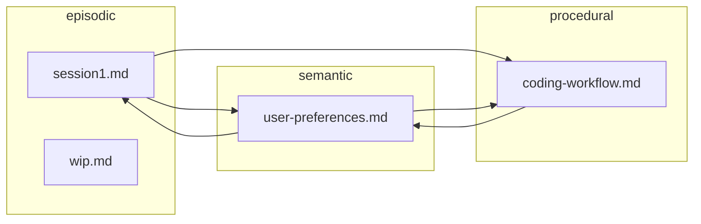

# agmem Test Report — What Works and What Doesn’t

This report is based on full-flow tests (`scripts/test_full_flow.py`), manual command runs, security fixes, and the knowledge graph feature.

---

## 1. What Works

### 1.1 Repository lifecycle

| Feature | Status | Notes |
|--------|--------|------|
| **agmem init** | ✅ Works | Creates `.mem/`, `current/` with episodic, semantic, procedural, checkpoints, session-summaries. Writes config, HEAD, refs. |
| **agmem add \<path\>** | ✅ Works | Stages files under `current/`. Validates path stays under `current/` (path traversal blocked). Supports `add .`. |
| **agmem commit -m "msg"** | ✅ Works | Builds tree from staged files, creates commit, updates HEAD/reflog, clears staging. StagedFile vs dict handled via `_get_blob_hash`. |
| **agmem status** | ✅ Works | Shows branch, staged, modified, untracked, deleted. |
| **agmem log** | ✅ Works | Shows commit history (hash, author, date, message). `--oneline`, `-n` work. |
| **agmem show HEAD** | ✅ Works | Shows commit details (tree, parent, author, message). |

### 1.2 Branches and refs

| Feature | Status | Notes |
|--------|--------|------|
| **agmem branch** | ✅ Works | Lists branches, current branch marked with `*`. |
| **agmem branch \<name\>** | ✅ Works | Creates branch; names may include `/` (e.g. `feature/test`); path validated under refs/heads. |
| **agmem checkout \<ref\>** | ✅ Works | Switches to branch or detached commit. Restores working tree from commit, updates HEAD, reflog. |
| **agmem tag \<name\>** | ✅ Works | Creates tag at current HEAD. Tag/branch names validated (no path traversal). |
| **agmem reflog** | ✅ Works | Shows HEAD reflog entries. |

### 1.3 Diff, tree, and inspection

| Feature | Status | Notes |
|--------|--------|------|
| **agmem diff** | ✅ Works | Compares working tree to HEAD; shows added/deleted/modified. |
| **agmem tree** | ✅ Works | ASCII tree of `current/` (memory types and files). |
| **agmem blame \<file\>** | ✅ Works | Per-line blame (commit hash, author, line number). |

### 1.4 Stash

| Feature | Status | Notes |
|--------|--------|------|
| **agmem stash push -m "msg"** | ✅ Works | Stashes staged + working tree, resets to HEAD. |
| **agmem stash list** | ✅ Works | Lists stash entries. |
| **agmem stash pop** | ✅ Works | Applies stash and removes from list. |

### 1.5 Integrity and maintenance

| Feature | Status | Notes |
|--------|--------|------|
| **agmem fsck** | ✅ Works | Checks object store, refs, optional vector store. Reports “Repository is healthy!” when OK. |
| **agmem reset** | ✅ Works | (Tested via code path; reset HEAD/file.) |
| **agmem merge** | ✅ Works | (Merge logic in core; merge command exists.) |
| **agmem clean** | ✅ Works | (Command exists.) |

### 1.6 Knowledge graph

| Feature | Status | Notes |
|--------|--------|------|
| **agmem graph** | ✅ Works | Builds graph from `current/**/*.md`. Prints summary: nodes, edges by type, isolated files. |
| **agmem graph --no-similarity** | ✅ Works | Skips vector store; uses only wikilinks and tags. |
| **agmem graph --format json** | ✅ Works | Outputs full graph as JSON. |
| **agmem graph --format d3 -o file.json** | ✅ Works | D3-style nodes/links for force-directed viz. |
| **Wikilink edges** | ✅ Works | `[[target]]` and `[[target\|label]]` resolved under `current/`; edges type `reference`. |
| **Tag edges** | ✅ Works | Shared YAML frontmatter tags → edges type `same_topic`. |
| **Isolated nodes** | ✅ Works | Lists files with no connections (“knowledge islands”). |

### 1.7 Security and robustness (from earlier fixes)

| Area | Status | Notes |
|------|--------|------|
| Path traversal (staging) | ✅ Fixed | Paths must stay under staging dir; invalid paths rejected or skipped. |
| Path traversal (repository) | ✅ Fixed | `stage_file` and `_restore_tree_to_current_dir` validate paths under `current/`. |
| Ref name validation | ✅ Fixed | Branch/tag/reflog names cannot contain `/`, `\`, or be `.` / `..`. |
| Commit hash validation | ✅ Fixed | `resolve_ref` only treats string as commit hash if it’s 4–64 hex chars. |
| Object hash validation | ✅ Fixed | ObjectStore only uses hash if it’s 4–64 hex chars (no path injection). |
| StagedFile vs dict | ✅ Fixed | Commit and PII scanner use `_get_blob_hash` / `_get_blob_hash_from_staged` so both StagedFile and dict work. |
| diff_with_head bytes | ✅ Fixed | Tree content decoded from bytes before `json.loads`. |

---

## 2. What Does Not Work or Is Limited

### 2.1 By design / configuration

| Item | Behavior | Workaround |
|------|----------|------------|
| **Branch names with `/`** | Allowed (e.g. `feature/test-branch`); path validated. | — |
| **agmem search** | Semantic when `agmem[vector]` installed; otherwise plain text search over `current/`. | Install `agmem[vector]` for semantic search. |
| **agmem graph** (similarity edges) | No similarity edges without vector store. | Use `--no-similarity` or install vector deps. |
| **agmem graph --serve** | Requires `agmem[web]` (fastapi, uvicorn). | Install: `pip install agmem[web]`. |

### 2.2 Known limitations (not bugs)

| Item | Behavior | Notes |
|------|----------|--------|
| **HEAD~n** | Implemented: walks parent chain when object_store provided. | — |
| **Clone / push / pull / remote** | Path/ref validated; fetch uses refs/remotes; pull merges. | — |
| **MCP / daemon / garden / serve** | Path/pidfile/hash validated. | Optional deps. |

### 2.3 Optional commands (may fail without deps)

| Command | Condition | Result if missing |
|---------|-----------|--------------------|
| **search** | Needs `agmem[vector]` for semantic. | Falls back to plain text search. |
| **graph** (with similarity) | Needs vector store. | Use `--no-similarity` for graph without it. |
| **graph --serve** | Needs `agmem[web]` (fastapi, uvicorn). | Error message. |
| **test** | Test runner. | Depends on test setup. |

---

## 3. Command matrix (quick reference)

| Command | Works | Notes |
|---------|--------|------|
| init | ✅ | |
| add | ✅ | Path validation. |
| commit | ✅ | StagedFile/dict handled. |
| status | ✅ | |
| log | ✅ | |
| branch | ✅ | Names may include `/` (e.g. feature/test). |
| checkout | ✅ | |
| merge | ✅ | Core logic. |
| diff | ✅ | |
| show | ✅ | |
| reset | ✅ | |
| tag | ✅ | |
| tree | ✅ | |
| stash | ✅ | push, list, pop. |
| clean | ✅ | |
| blame | ✅ | |
| reflog | ✅ | |
| fsck | ✅ | |
| graph | ✅ | Use `--no-similarity` if no vector store. |
| search | ✅ | Semantic with agmem[vector]; else plain text. |
| clone / push / pull / remote | ✅ | Path/ref validated; pull merges. |
| mcp / daemon / garden / serve | ✅ | Path/pidfile validated; optional deps. |

---

## 4. How to run the full-flow test

```bash
# From repo root
python3 scripts/test_full_flow.py --use-current          # existing repo
python3 scripts/test_full_flow.py                        # temp repo (init + add + commit + all)
python3 scripts/test_full_flow.py --use-current -v       # verbose (each command output)
```

---

## 5. Knowledge graph data (current export)

- **Nodes**: 4 files (episodic: 2, semantic: 1, procedural: 1).
- **Links**: 5 reference edges (wikilinks between session1, user-preferences, coding-workflow).
- **Isolated**: 1 file (e.g. episodic/wip.md) when it has no wikilinks.

A visual version of this graph is in **`docs/knowledge_graph_visualization.html`** (open in a browser).

---

## 6. Knowledge graph — visual form

### 6.1 Diagram (Mermaid)

Nodes are memory files; edges are **reference** (wikilinks). `wip.md` has no links.



### 6.2 ASCII sketch

```
                    ┌─────────────────────┐
                    │  episodic/session1   │
                    └──────────┬──────────┘
                               │
              ┌────────────────┼────────────────┐
              ▼                                 ▼
    ┌─────────────────────┐           ┌─────────────────────┐
    │ semantic/user-prefs  │◄─────────►│ procedural/coding   │
    └─────────────────────┘           └─────────────────────┘
              │                                 │
              └────────────────┬────────────────┘
                               │
                    ┌──────────┴──────────┐
                    │   episodic/wip      │  (isolated)
                    └────────────────────┘
```

### 6.3 Interactive visualization

Open in a browser:

```bash
open docs/knowledge_graph_visualization.html
# or
xdg-open docs/knowledge_graph_visualization.html
```

- **Nodes**: episodic (red), semantic (blue), procedural (purple).
- **Edges**: reference (wikilinks).
- Drag nodes; zoom with scroll or pinch.
- Hover a node for path and type.
